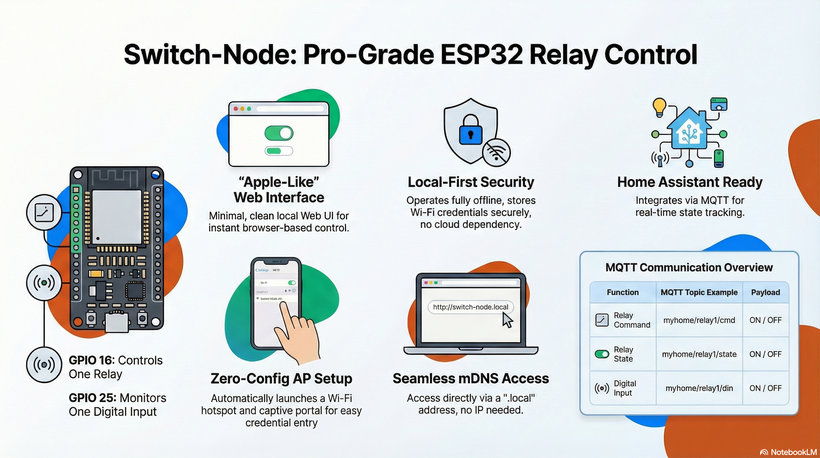
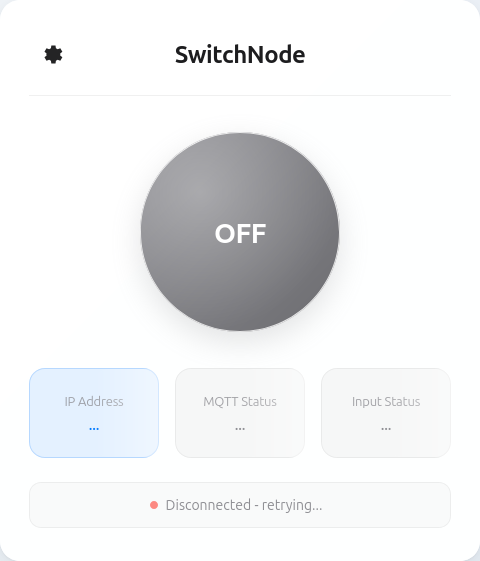

# ESP32 SwitchNode  
**Single Relay + Digital Input with AP Setup, Web UI, MQTT & mDNS**

RelayNode is a **product-style ESP32 firmware** for controlling a single relay and monitoring one digital input.  
It is designed with a **clean Apple-like UX**, robust recovery flow, and seamless integration with **Home Assistant via MQTT**.

---
## Materials
1. ESP32
2. Relay
   


---

## ✨ Key Features

- 🔌 **1 Relay Output** (GPIO 16) or other IO pin
- 🔘 **1 Digital Input** (GPIO 25, dry contact to GND, internal pull-up)
- 📶 **AP Setup Mode** (no hardcoded Wi-Fi)
- 🌐 **Minimal Web UI**
  - Main control page (relay only)
  - Settings page (MQTT configuration)
- 📡 **mDNS Support**
  - Access device via `switchnode-XXXXXX.local`
- 🔁 **Automatic AP fallback**
  - If Wi-Fi fails, device returns to setup mode
- 🔐 **Secure MQTT configuration**
  - Password never exposed
  - Blank password keeps existing one
- 🏠 **Home Assistant compatible** (manual MQTT entities)

---

## 🧠 Device Flow (User Experience)

### First Boot / Wi-Fi Failure
1. Device starts in **Access Point (AP) mode**
2. Creates Wi-Fi: SwitchNode-esp32-xxxxxx
3. Captive portal opens automatically
4. User enters Wi-Fi credentials
5. Device reboots and connects to Wi-Fi

### Normal Operation
- Open browser: http://switchnode-xxxxxx.local
- Control relay instantly
- Tap ⚙️ icon to configure MQTT

If Wi-Fi becomes unavailable → **AP mode returns automatically**

---

## 📁 Project Structure (PlatformIO)

```
relaynode/
├── platformio.ini
├── src/
│    └── main.cpp
└── data/
     └── www/
          ├── ap.html # Wi-Fi setup (AP mode)
          ├── index.html # Main relay control
          ├── settings.html # MQTT configuration
          ├── app.js # UI logic
          └── style.css # Apple-like styling
```

---

## 🧩 Hardware Configuration

| Function        | GPIO |
|-----------------|------|
| Relay Output    | 16   |
| Digital Input   | 25   |

- Digital input uses `INPUT_PULLUP`
- Connect input **to GND** when active
- Relay logic level configurable in firmware

---

## 🛠️ Build & Flash

### Requirements
- PlatformIO (VS Code)
- ESP32 board
- USB cable
- easy flash
  - download factory.bin
  - use esphome web (https://web.esphome.io/) to flash factory.bin into esp32

---
## 🌍 Accessing the Device

After Wi-Fi setup, access the device via:
- http://switchnode-XXXXXX.local
  - Where XXXXXX is the last 3 bytes of the ESP32 MAC address
  - (e.g. switchynode-AB12CD.local)
- 

If mDNS is not available:
  - Check your router’s device list
  - Look for SwitchNode-esp32-AB12CD

---
## 📡 MQTT Integration
MQTT Topics (example)

If user configures:
  - Command Topic: myhome/relay1/cmd

The device uses:
```
Command: myhome/relay1/cmd
State:   myhome/relay1/state
Input:   myhome/relay1/din
Payloads: ON / OFF
```
---
## 🏠 Home Assistant Configuration

Add the following to configuration.yaml:
```
mqtt:
  switch:
    - name: "RelayNode Relay"
      unique_id: relaynode_relay_1
      command_topic: "myhome/relay1/cmd"
      state_topic: "myhome/relay1/state"
      payload_on: "ON"
      payload_off: "OFF"
      state_on: "ON"
      state_off: "OFF"
      retain: true

  binary_sensor:
    - name: "RelayNode Input"
      unique_id: relaynode_input_1
      state_topic: "myhome/relay1/din"
      payload_on: "ON"
      payload_off: "OFF"
      device_class: door
```

Restart Home Assistant after saving.

---

## 🔐 Security Notes

- Wi-Fi credentials stored securely in ESP32 NVS
- MQTT password: Never returned to UI
- Only updated if user enters a new value
- No cloud dependency
- Works fully offline (local network)
